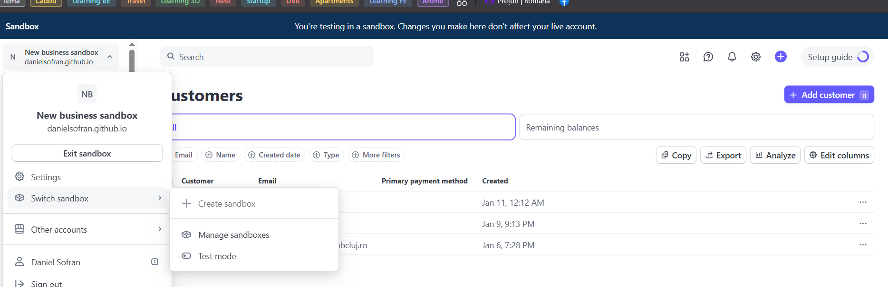
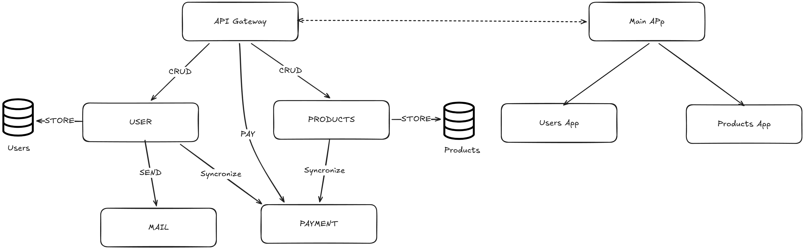

# Synchronizing with Stripe API: an Event-Driven Payment Platform with Nx and NestJS Microservices

Modern applications rarely live as a single monolith. Payments, users, products, emails, and authentication all evolve at different speeds and often require different scalability and reliability guarantees.

In this article, we will build a Stripe-powered payment platform using:

- Nx for monorepo management
- NestJS microservices
- Stripe (sandbox / test mode)
- Kafka for domain events
- RabbitMQ for request-response and side effects
- PostgreSQL for service-local persistence

The result is a clean, event-driven architecture where domain services own their data, and Stripe is synchronized asynchronously.

## 1. Stripe Sandbox Setup

Before writing any code, configure Stripe in test mode.

1. Create a Stripe account
2. Switch to Test Mode
3. Copy STRIPE_SECRET_KEY

Store these in your environment:

```env
STRIPE_KEY=sk_test_...
STRIPE_SUCCESS_REDIRECT_URL=http://localhost:3000/payment/success
```




Stripe will act as an external bounded context. No service except the payment service talks to Stripe directly.

## 2. Nx Monorepo Structure

Nx allows us to colocate multiple NestJS applications while keeping boundaries explicit.

Our workspace looks conceptually like this:

```
apps/
├─ gateway
├─ users-ms
├─ products-ms
├─ payments-ms
└─ mail-ms
```

Each microservice:
- Has its own database 
- Exposes message patterns, not HTTP 
- Communicates through a broker

## 3.Architecture Overview

At a high level:

- Gateway
    - HTTP entry point
  - Authentication
      - Orchestration
- Users Service
    - Owns users table
  - Emits user lifecycle events
- Products Service
    - Owns products table
  - Emits product lifecycle events
- Payments Service
    - Owns Stripe synchronization
  - Creates customers, products, prices, payments
- Mail Service
    - Sends emails asynchronously

Transport choices

| Purpose               | Transport    |
|-----------------------|--------------|
| CRUD request/response | RabbitMQ     |
| Payment events        | Kafka        |
| External payments     | Stripe API   |



## 4. Users Microservice (Data Ownership)

The users service owns user persistence and nothing else.

Key responsibilities:

- Store users in PostgreSQL

- Emit events when users change

Example message handler:

```typescript
@MessagePattern('create')
async create(dto: CreateUserDto) {
    const user = await this.userService.create(dto);
    this.paymentClient.emit('addUser', user);
    return user;
}
```

**Important design choice**

The users service does not store Stripe IDs as a source of truth. Stripe synchronization is delegated to the payment service.

## 5. Products Microservice (Catalog Ownership)

Products follow the same pattern:

- PostgreSQL for persistence

- Emits events on create/update/delete

- No Stripe logic

Minimal example:

```typescript
@MessagePattern('update')
async update(dto: UpdateProductDto) {
    const product = await this.productService.update(dto.id, dto);
    this.paymentClient.emit('addProduct', product);
    return product;
}
```

This creates eventual consistency:

- The product exists immediately in the catalog

- Stripe is updated asynchronously

## 6. Payment Microservice (Stripe Integration)

This is the most critical service.

#### Responsibilities

- Create or update:

    - Stripe customers

  - Stripe products

      - Stripe prices

- Handle:
  - PaymentIntents
  - PaymentLinks

**Never expose Stripe directly to other services**

#### Kafka Consumers

The payment service listens to Kafka topics:

```typescript
@MessagePattern('addUser')
createOrUpdateCustomer(user: User) {
    return this.userStripeService.createOrGetCustomer(user);
}
```

```typescript
@MessagePattern('addProduct')
syncProduct(product: Product) {
    return this.productStripeService.createOrGetProduct(product);
}
```

### Checkout Flow

For multiple products, the gateway asks the payment service to generate a link:

```typescript
this.paymentClient.send('getPaymentLink', {
    products: cart.products,
    user
});
```

Inside the payment service:

- Products are resolved to Stripe prices

- A PaymentLink is created

- The URL is returned to the client

## 7. Gateway: HTTP to Messaging Bridge

The gateway is the only HTTP-facing application.

Responsibilities:

- Authentication (JWT)

- Input validation

- Mapping HTTP → messages

Example product endpoint:

```typescript
@Post()
async create(@Body() dto: object) {
    return this.productsClient.send('create', dto);
}
```

Example payment endpoint:

```typescript
@Post('payment/link')
async paymentLink(@Request() req, @Body() cart: Cart) {
    return this.paymentClient.send('getPaymentLink', {
        products: cart.products,
        user: {
            id: req.user.userId,
            email: req.user.email,
        },
    });
}
```

The gateway never:

- Touches databases
- Talks to Stripe
- Contains business logic

## 8. Microservice Bootstrapping

Each service boots independently with its transport:

RMQ-based services
```typescript
NestFactory.createMicroservice(AppModule, {
    transport: Transport.RMQ,
    options: {
        urls: [process.env.RABBITMQ_URL],
        queue: 'user_queue',
        queueOptions: { durable: true },
    },
});
```

Kafka-based payment service
```typescript
NestFactory.createMicroservice(AppModule, {
    transport: Transport.KAFKA,
    options: {
        client: {
            brokers: process.env.KAFKA_BROKERS.split(','),
        },
        consumer: {
            groupId: 'payments-group',
        },
    },
});
```

Each service is independently deployable.

## 9. Why This Architecture Works

#### Clear boundaries

- Each service owns its data

- Stripe logic is centralized

#### Event-driven

- No tight coupling

- Services evolve independently

#### Production-ready patterns

- Idempotent Stripe sync

- Async side effects

- Scalable transports

10. Final Thoughts

This setup mirrors real-world payment platforms:

- Stripe treated as an external system

- Domain events drive synchronization

- Gateways remain thin

- Microservices remain focused

If you are building payments in a microservice architecture, this pattern scales well, remains understandable, and keeps Stripe complexity contained.